# LAB01 — CrewAI aplicado à Observabilidade, AIOps e RCA

**Autor:** Marcos  
**Ambiente-alvo:** Ubuntu 24.04, Visual Studio Code, Python 3.12, CrewAI e `uv`  
**Tema:** uso de agentes de IA para apoiar análise de incidentes em ambientes de missão crítica  
**Status:** laboratório funcional inicial, preparado para evolução multiagente

---

## Resumo

Este laboratório apresenta uma implementação inicial de uma arquitetura baseada em agentes com **CrewAI** para apoiar a análise de incidentes de TI, com foco em **observabilidade**, **AIOps** e **RCA**. A proposta parte da ideia acadêmica de observabilidade como capacidade de inferir estados internos de um sistema a partir de sinais externos. Em sistemas dinâmicos, essa ideia aparece formalmente em teoria de controle. Em sistemas modernos de software, a mesma noção é reinterpretada a partir de telemetria operacional, como métricas, logs, traces, eventos, metadados e relações de dependência.

O LAB01 implementa uma Crew mínima com agentes especializados em análise de incidente e redação de RCA. O objetivo é demonstrar como uma descrição textual de incidente pode ser transformada em uma análise estruturada, indicando sintomas, impacto provável, hipótese de causa raiz, evidências necessárias e ações recomendadas.

---

## Palavras-chave

CrewAI; Observabilidade; AIOps; RCA; SRE; Agentes de IA; LLM; Telemetria; Logs; Métricas; Traces; MTTR; Incidentes.

---

## 1. Contexto do laboratório

Ambientes de TI modernos são compostos por serviços distribuídos, APIs, filas, bancos de dados, containers, funções serverless, camadas de rede e dependências externas. Nesse tipo de arquitetura, um incidente raramente possui uma única evidência isolada. Em geral, a análise depende da correlação entre sinais de telemetria e contexto operacional.

O LAB01 foi criado para representar um primeiro passo prático: usar uma Crew de agentes para receber um relato de incidente e produzir uma análise técnica. Neste estágio, o incidente é informado diretamente no arquivo `main.py`. Em versões futuras, ele pode vir de Teams, Jira, ferramentas de observabilidade, logs centralizados, CMDB, banco vetorial ou API interna.

---

## 2. Problema de pesquisa

A análise manual de incidentes em ambientes distribuídos apresenta limitações recorrentes:

1. dificuldade de correlacionar sinais de múltiplas fontes;
2. excesso de alertas e ruído operacional;
3. demora para formular hipóteses iniciais;
4. perda de contexto durante a sala de crise;
5. documentação inconsistente do pós-incidente;
6. dependência de especialistas específicos;
7. dificuldade para transformar telemetria em decisão.

A pergunta central do laboratório é:

> Como agentes de IA podem apoiar a análise inicial de incidentes de TI, transformando sinais textuais e operacionais em hipóteses estruturadas de causa raiz?

---

## 3. Hipótese

A hipótese do LAB01 é que uma arquitetura multiagente baseada em LLMs pode reduzir o esforço cognitivo inicial da análise de incidentes ao organizar o raciocínio técnico em etapas explícitas:

1. leitura do incidente;
2. identificação de sintomas;
3. separação entre evidência e hipótese;
4. avaliação de impacto;
5. formulação de causa provável;
6. recomendação de próximos passos;
7. geração de relatório RCA.

O uso de agentes não elimina a validação humana. A função do sistema é apoiar a investigação, acelerar a organização do contexto e melhorar a qualidade da documentação.

---

## 4. Fundamentação acadêmica

### 4.1 Observabilidade em sistemas dinâmicos

Em teoria de controle, observabilidade está relacionada à capacidade de reconstruir ou inferir estados internos de um sistema a partir de entradas e saídas observadas. Um sistema discreto pode ser representado por:

```text
x(k + 1) = A x(k) + B u(k)
y(k)     = C x(k) + D u(k)
```

Onde:

- `x(k)` representa o estado interno;
- `u(k)` representa entradas;
- `y(k)` representa saídas observáveis;
- `A`, `B`, `C`, `D` representam matrizes do sistema.

A matriz de observabilidade em tempo discreto pode ser expressa como:

```text
O_n =
[ C          ]
[ C A        ]
[ C A^2      ]
[ ...        ]
[ C A^(n-1)  ]
```

Um sistema é observável quando o estado inicial pode ser determinado a partir das saídas observadas em uma janela de tempo. Em termos práticos:

```text
rank(O_n) = n
```

No contexto de TI, a analogia é direta:

| Teoria de controle | Observabilidade em TI |
|---|---|
| Estado interno `x(k)` | Condição real dos serviços, dependências e recursos |
| Saída `y(k)` | Métricas, logs, traces, eventos e sintomas |
| Entrada `u(k)` | Deploys, carga, mudanças, tráfego, falhas externas |
| Matriz de observabilidade | Capacidade de correlacionar sinais e inferir estado |
| Sistema não observável | Sistema com pontos cegos, baixa rastreabilidade e baixa explicabilidade |

A proposta do LAB01 usa essa analogia como base conceitual: agentes de IA podem funcionar como uma camada de interpretação sobre sinais externos, organizando a inferência sobre o estado interno do ambiente.

---

### 4.2 Observabilidade em software

Em engenharia de software moderna, observabilidade é a capacidade de compreender o comportamento de um sistema a partir dos seus sinais externos. Ela ultrapassa o monitoramento tradicional, pois não se limita a verificar se algo está “up” ou “down”. O foco passa a ser entender comportamento, impacto, contexto e causa provável.

Os sinais clássicos são:

| Sinal | Função na análise |
|---|---|
| Métricas | Indicam comportamento agregado ao longo do tempo |
| Logs | Registram eventos e detalhes de execução |
| Traces | Mostram o caminho de uma requisição entre serviços |
| Eventos | Indicam mudanças relevantes, como deploy, falha, reinício ou alteração |
| Metadados | Dão contexto, como serviço, versão, região, host, rota ou status |
| Topologia | Mostra dependências entre componentes |

Em arquiteturas distribuídas, uma única métrica dificilmente explica o incidente. A análise depende da relação entre sinais.

---

### 4.3 AIOps e análise de causa raiz

AIOps combina dados operacionais, automação, análise estatística e modelos de IA/ML para apoiar operações de TI. No contexto do LAB01, AIOps é tratado como uma camada de raciocínio que ajuda a:

1. reduzir ruído;
2. priorizar sintomas;
3. identificar anomalias;
4. sugerir hipóteses;
5. classificar impacto;
6. apoiar RCA;
7. recomendar ações.

O LAB01 ainda não implementa coleta real de telemetria, mas cria a base lógica para receber esses dados no futuro.

---

## 5. Objetivos

### 5.1 Objetivo geral

Criar um laboratório funcional em CrewAI para análise inicial de incidentes com base em agentes especializados, estruturando uma base para evolução em direção a um BOT de war room e RCA.

### 5.2 Objetivos específicos

1. Criar um projeto CrewAI funcional no Ubuntu 24.04.
2. Executar o projeto pelo Visual Studio Code.
3. Definir agentes em `agents.yaml`.
4. Definir tarefas em `tasks.yaml`.
5. Conectar agentes e tarefas em `crew.py`.
6. Enviar um incidente por `main.py`.
7. Gerar análise técnica em português.
8. Preparar o projeto para múltiplos agentes.
9. Documentar arquitetura e fluxos com Mermaid.
10. Criar base para integração futura com dados reais de observabilidade.

---

## 6. Arquitetura conceitual

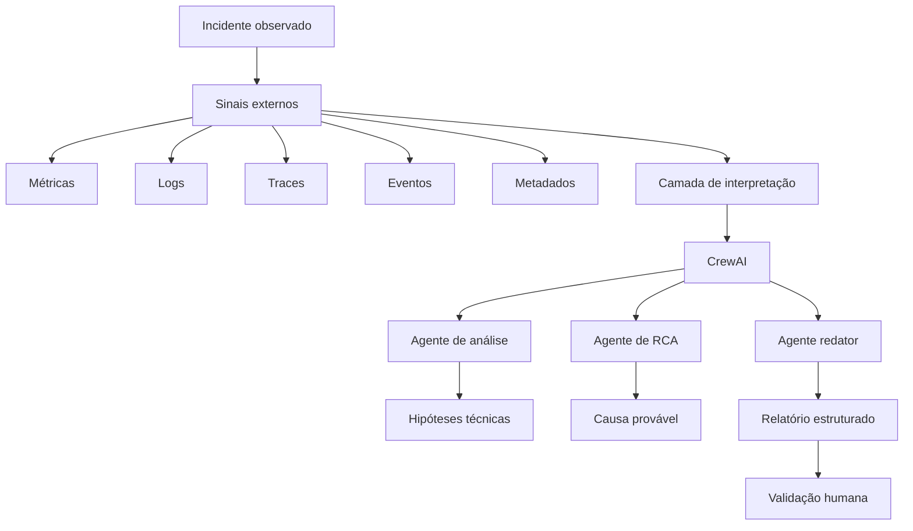

---

## 7. Arquitetura do LAB01

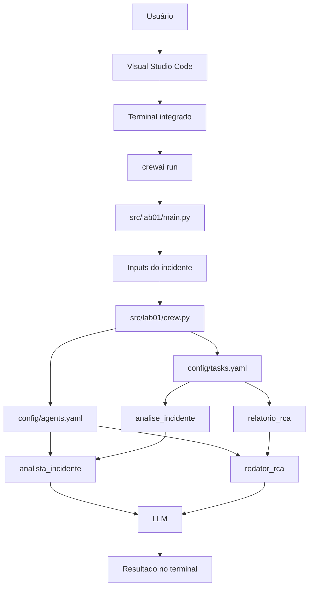

---

## 8. Estrutura do projeto

```text
lab01/
├── .venv/
├── .env
├── pyproject.toml
├── README.md
├── LAB01.md
├── knowledge/
├── src/
│   └── lab01/
│       ├── __init__.py
│       ├── main.py
│       ├── crew.py
│       ├── config/
│       │   ├── agents.yaml
│       │   └── tasks.yaml
│       └── tools/
└── uv.lock
```

---

## 9. Papel dos principais arquivos

| Arquivo | Responsabilidade |
|---|---|
| `main.py` | Define os inputs e executa `kickoff()` |
| `crew.py` | Registra agentes, tarefas e o processo da Crew |
| `agents.yaml` | Define os papéis dos agentes |
| `tasks.yaml` | Define as tarefas e saídas esperadas |
| `.env` | Guarda chaves e variáveis de ambiente |
| `knowledge/` | Área futura para documentos de apoio |
| `LAB01.md` | Documentação acadêmica e operacional do laboratório |

---

## 10. Fluxo de execução

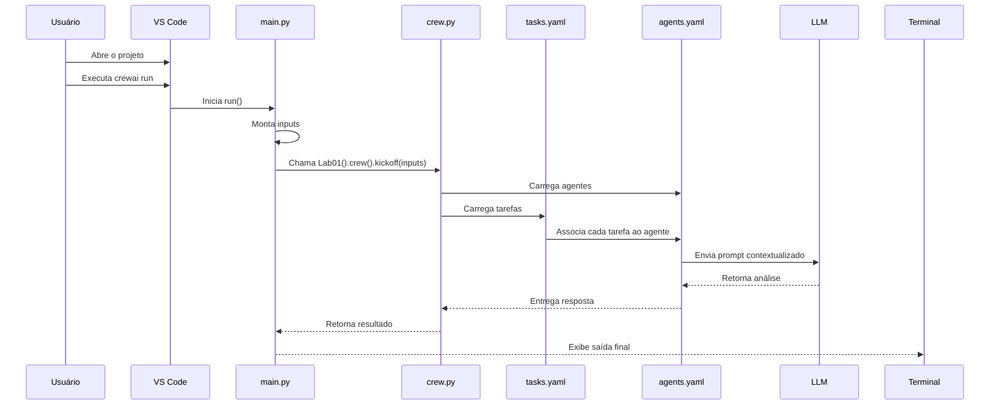

---

## 11. Modelo de raciocínio do agente

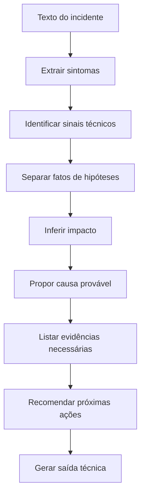

---

## 12. Pipeline analítico proposto

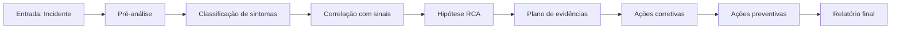

---

## 13. Exemplo do incidente usado no laboratório

```text
API de pagamentos apresentou aumento de latência entre 10h05 e 10h40.
Houve crescimento de erros HTTP 500.
A ferramenta de observabilidade indicou degradação no serviço de autenticação.
```

### Interpretação esperada

| Elemento | Interpretação |
|---|---|
| API de pagamentos | Serviço impactado |
| Aumento de latência | Sintoma de desempenho |
| 10h05 a 10h40 | Janela temporal |
| HTTP 500 | Erro interno |
| Serviço de autenticação | Dependência suspeita |
| Degradação | Possível causa ou fator correlato |

---

## 14. Código recomendado para `main.py`

```python
#!/usr/bin/env python
import warnings
from datetime import datetime

from lab01.crew import Lab01

warnings.filterwarnings("ignore", category=SyntaxWarning, module="pysbd")


def run():
    """
    Run the crew.
    """
    inputs = {
        "topic": "Observabilidade e análise de incidentes com AIOps",
        "incidente": """
        API de pagamentos apresentou aumento de latência entre 10h05 e 10h40.
        Houve crescimento de erros HTTP 500.
        A ferramenta de observabilidade indicou degradação no serviço de autenticação.
        """,
        "current_year": str(datetime.now().year)
    }

    try:
        result = Lab01().crew().kickoff(inputs=inputs)
        print(result)

        with open("relatorio_rca.md", "w", encoding="utf-8") as file:
            file.write(str(result))

    except Exception as e:
        raise Exception(f"An error occurred while running the crew: {e}")


if __name__ == "__main__":
    run()
```

---

## 15. Código recomendado para `crew.py`

```python
from crewai import Agent, Crew, Process, Task
from crewai.project import CrewBase, agent, crew, task


@CrewBase
class Lab01:
    """Lab01 crew"""

    agents_config = "config/agents.yaml"
    tasks_config = "config/tasks.yaml"

    @agent
    def analista_incidente(self) -> Agent:
        return Agent(
            config=self.agents_config["analista_incidente"],
            verbose=True
        )

    @agent
    def redator_rca(self) -> Agent:
        return Agent(
            config=self.agents_config["redator_rca"],
            verbose=True
        )

    @task
    def analise_incidente(self) -> Task:
        return Task(
            config=self.tasks_config["analise_incidente"]
        )

    @task
    def relatorio_rca(self) -> Task:
        return Task(
            config=self.tasks_config["relatorio_rca"]
        )

    @crew
    def crew(self) -> Crew:
        return Crew(
            agents=self.agents,
            tasks=self.tasks,
            process=Process.sequential,
            verbose=True
        )
```

---

## 16. Configuração recomendada para `agents.yaml`

```yaml
analista_incidente:
  role: >
    Analista de Incidentes de TI
  goal: >
    Analisar incidentes de tecnologia, correlacionar sinais de observabilidade
    e sugerir hipóteses de causa raiz.
  backstory: >
    Especialista em Observabilidade, AIOps, SRE, métricas, logs, traces,
    eventos e análise de causa raiz para ambientes de missão crítica.

redator_rca:
  role: >
    Redator Técnico de RCA
  goal: >
    Transformar a análise do incidente em um relatório técnico claro,
    objetivo e útil para equipes de operação, engenharia e liderança.
  backstory: >
    Profissional com experiência em documentação de incidentes,
    post-mortem, comunicação técnica e relatórios de continuidade operacional.
```

---

## 17. Configuração recomendada para `tasks.yaml`

```yaml
analise_incidente:
  description: >
    Analise o seguinte incidente:

    {incidente}

    Considere o ano atual: {current_year}

    Gere:
    1. Resumo do problema
    2. Sintomas identificados
    3. Impacto provável
    4. Possível causa raiz
    5. Evidências técnicas necessárias
    6. Próximas ações recomendadas
  expected_output: >
    Uma análise técnica em português, com separação entre fatos, hipóteses,
    evidências necessárias e ações recomendadas.
  agent: analista_incidente

relatorio_rca:
  description: >
    Com base na análise anterior, gere um relatório de RCA em português.

    O relatório deve conter:
    1. Resumo executivo
    2. Linha do tempo provável
    3. Serviços impactados
    4. Hipótese de causa raiz
    5. Evidências que precisam ser confirmadas
    6. Ações corretivas
    7. Ações preventivas
    8. Riscos residuais
    9. Próximos passos
  expected_output: >
    Um relatório de RCA estruturado, claro e objetivo, pronto para revisão humana.
  agent: redator_rca
```

---

## 18. Diagrama de associação entre agentes e tarefas

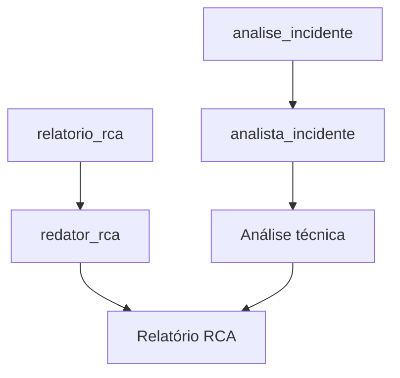

---

## 19. Modelo de saída esperado

```text
Resumo do problema:
A API de pagamentos apresentou degradação entre 10h05 e 10h40, com aumento de latência e erros HTTP 500.

Sintomas identificados:
- Latência elevada
- Erros HTTP 500
- Degradação no serviço de autenticação
- Possível impacto em transações dependentes de autorização

Impacto provável:
Usuários podem ter enfrentado falhas ou lentidão durante o fluxo de pagamento.

Hipótese de causa raiz:
Instabilidade, saturação ou falha parcial no serviço de autenticação pode ter impactado a API de pagamentos.

Evidências necessárias:
- Logs da API de pagamentos
- Logs do serviço de autenticação
- Traces entre pagamento e autenticação
- Métricas de CPU, memória, pool de conexão e latência
- Eventos de deploy ou mudança na janela do incidente

Ações recomendadas:
- Validar dependência entre pagamentos e autenticação
- Comparar métricas antes, durante e depois da janela
- Verificar deploys ou mudanças recentes
- Confirmar se houve saturação de recursos
- Registrar RCA com evidências confirmadas
```

---

## 20. Mapeamento acadêmico entre observabilidade e RCA

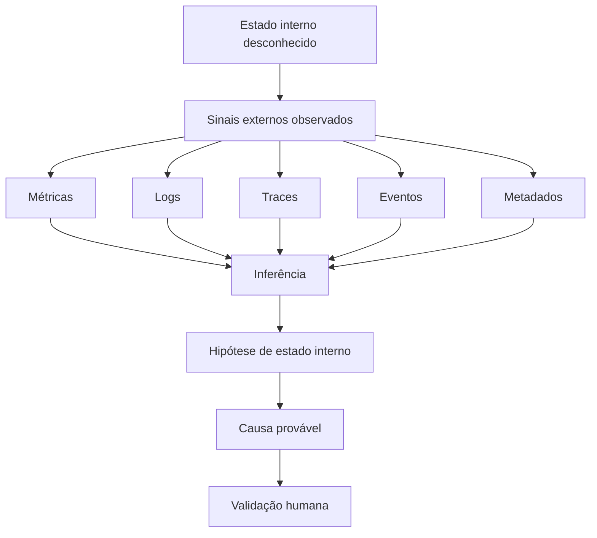

---

## 21. Modelo conceitual de dados para uma evolução futura

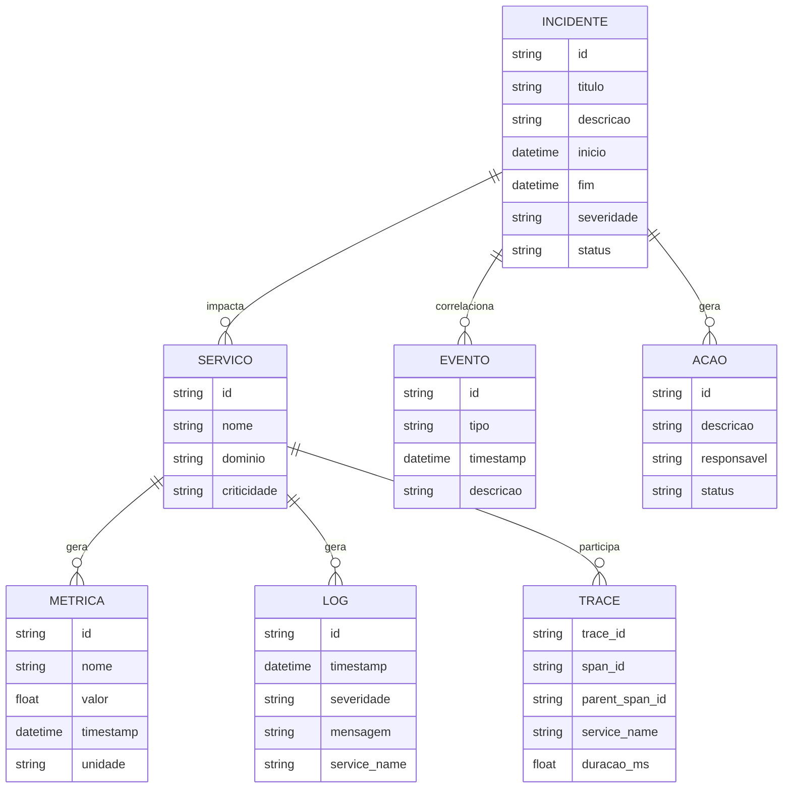

---

## 22. Modelo de análise baseado em evidência

| Camada | Pergunta analítica | Evidência esperada |
|---|---|---|
| Sintoma | O que foi percebido? | Erro, latência, indisponibilidade |
| Localização | Onde ocorreu? | Serviço, rota, host, região, dependência |
| Tempo | Quando ocorreu? | Janela temporal e duração |
| Propagação | O que foi afetado? | Serviços upstream e downstream |
| Mudança | O que mudou? | Deploy, configuração, carga, falha externa |
| Causa provável | Por que ocorreu? | Evidência correlacionada |
| Ação | O que fazer? | Correção, contenção, prevenção |

---

## 23. Fluxo futuro com dados reais de observabilidade

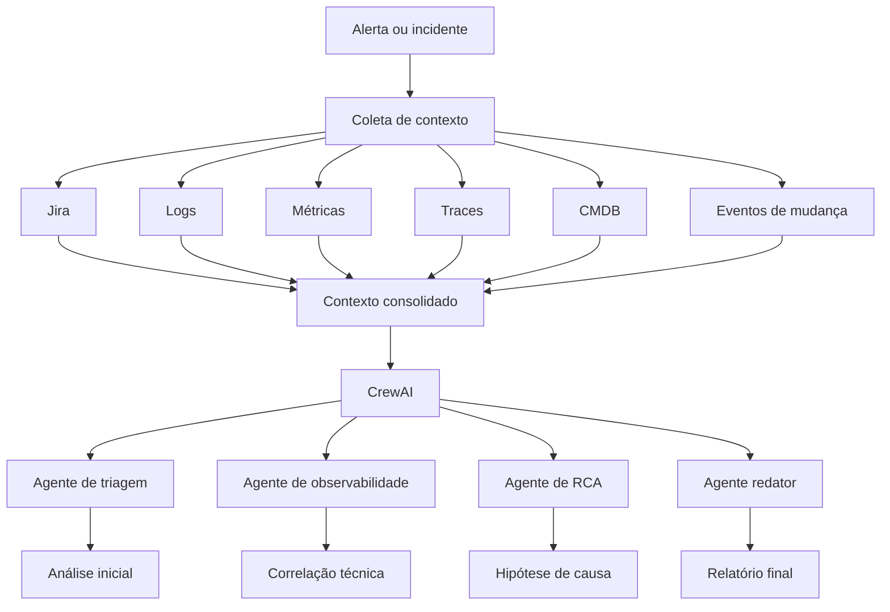

---

## 24. Proposta de evolução multiagente

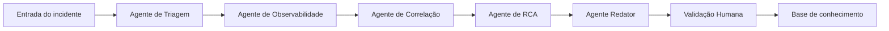

### Papéis sugeridos

| Agente | Função |
|---|---|
| `agente_triagem` | Classificar severidade, domínio e escopo inicial |
| `agente_observabilidade` | Avaliar sinais técnicos e lacunas de evidência |
| `agente_correlacao` | Relacionar sintomas, dependências e eventos |
| `agente_rca` | Formular causa provável e validar hipóteses |
| `agente_redator` | Gerar relatório final e resumo executivo |
| `agente_memoria` | Registrar aprendizados em base de conhecimento |

---

## 25. Arquitetura futura para BOT de War Room

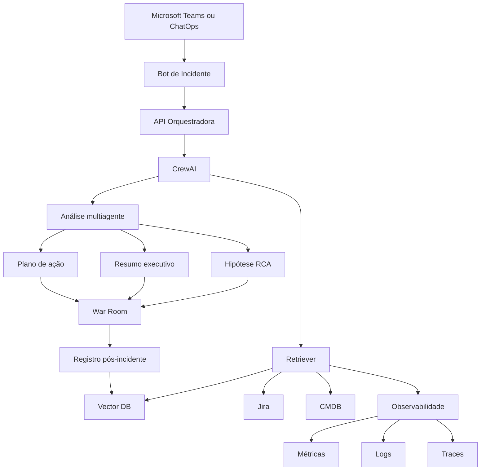

---

## 26. Ciclo de vida do incidente

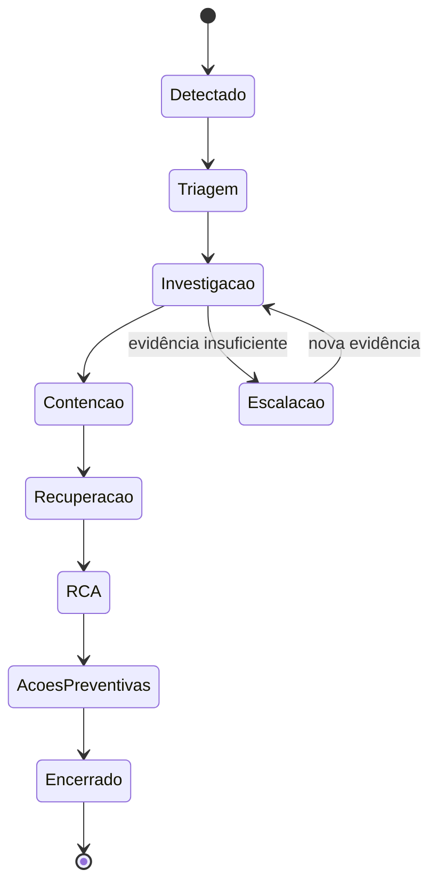

---

## 27. Critérios de avaliação do LAB01

O laboratório pode ser avaliado por critérios técnicos e qualitativos.

| Critério | Pergunta | Resultado esperado |
|---|---|---|
| Execução | `crewai run` funciona? | Sim |
| Clareza | A saída é compreensível? | Sim |
| Estrutura | A análise separa fatos e hipóteses? | Sim |
| Utilidade | O relatório ajuda uma war room? | Sim |
| Extensibilidade | Permite novos agentes? | Sim |
| Reprodutibilidade | Outro usuário consegue executar? | Sim |

---

## 28. Métricas futuras de sucesso

| Métrica | Descrição |
|---|---|
| Tempo de análise inicial | Tempo até a primeira hipótese útil |
| Qualidade da RCA | Grau de aderência entre hipótese e evidência confirmada |
| Redução de ruído | Quantidade de alertas descartados por baixa relevância |
| Cobertura de evidências | Percentual de sinais avaliados |
| Reutilização de conhecimento | Incidentes futuros apoiados por casos passados |
| Aderência ao processo | Uso do relatório em pós-incidente |

---

## 29. Comandos úteis

### Rodar a Crew

```bash
crewai run
```

### Ativar o ambiente virtual

```bash
source .venv/bin/activate
```

### Verificar uso de `{topic}`

```bash
grep -R "{topic}\|topic" -n src/lab01
```

### Verificar o `main.py`

```bash
sed -n '1,120p' src/lab01/main.py
```

### Abrir projeto no VS Code

```bash
code .
```

---

## 30. Erros comuns e correções

### 30.1 Erro: `Template variable 'topic' not found`

**Causa:** existe `{topic}` em algum YAML, mas o `main.py` não envia `"topic"`.

**Correção:**

```python
inputs = {
    "topic": "Observabilidade e análise de incidentes com AIOps",
    "incidente": "...",
    "current_year": str(datetime.now().year)
}
```

---

### 30.2 Erro: `KeyError: 'analista_incidente'`

**Causa:** o `tasks.yaml` usa `agent: analista_incidente`, mas esse agente não existe em `crew.py` ou `agents.yaml`.

**Correção:** garantir que os três nomes estejam alinhados:

```text
agents.yaml  -> analista_incidente
tasks.yaml   -> agent: analista_incidente
crew.py      -> def analista_incidente(self)
```

---

### 30.3 Duas funções `run()` no `main.py`

**Causa:** a segunda função sobrescreve a primeira em Python.

**Correção:** manter apenas uma função `run()`.

---

## 31. Fluxo de diagnóstico de erros

```mermaid
flowchart TD
    A[Erro no crewai run] --> B{Mensagem do erro}
    B -->|topic not found| C[Verificar inputs no main.py]
    C --> D[Adicionar topic ou remover topic dos YAMLs]
    B -->|KeyError agente| E[Verificar tasks.yaml]
    E --> F[Confirmar agente em agents.yaml e crew.py]
    B -->|run não executa| G[Verificar if main]
    G --> H[Adicionar run()]
    B -->|erro de chave API| I[Verificar .env]
    I --> J[Confirmar OPENAI_API_KEY]
    D --> K[Executar crewai run novamente]
    F --> K
    H --> K
    J --> K
```

---

## 32. Método experimental do laboratório

### 32.1 Entrada

Um incidente textual informado no `main.py`.

### 32.2 Tratamento

O CrewAI recebe os inputs e aciona as tasks configuradas em `tasks.yaml`.

### 32.3 Processamento

Cada task é atribuída a um agente definido em `agents.yaml`.

### 32.4 Saída

A Crew retorna uma análise técnica e, opcionalmente, grava um relatório `.md`.

### 32.5 Validação

A análise precisa ser revisada por um humano, preferencialmente alguém com conhecimento do ambiente afetado.

---

## 33. Protocolo de teste recomendado

1. Rodar o incidente base.
2. Alterar o serviço afetado.
3. Alterar o tipo de erro.
4. Adicionar informação de deploy.
5. Adicionar métrica de CPU ou memória.
6. Adicionar trace ou dependência.
7. Comparar a qualidade das hipóteses.
8. Registrar o resultado em `relatorio_rca.md`.

### Exemplo de segundo teste

```python
"incidente": """
Serviço de checkout apresentou erro HTTP 503 após implantação às 14h20.
A fila de pagamento aumentou de 200 para 9.000 mensagens.
A latência média subiu de 180 ms para 2.800 ms.
"""
```

---

## 34. Limitações do LAB01

1. Não consulta dados reais de observabilidade.
2. Não valida hipóteses automaticamente.
3. Não acessa Jira, CMDB ou base histórica.
4. Não executa correlação estatística.
5. Não possui memória vetorial.
6. Não possui mecanismo de confiança da hipótese.
7. Não diferencia evidência confirmada de evidência ausente sem instrução explícita.
8. Depende da qualidade do prompt e da descrição do incidente.

---

## 35. Evoluções recomendadas

### 35.1 Entrada por linha de comando

Permitir:

```bash
crewai run --incidente "descrição do incidente"
```

### 35.2 Entrada via arquivo

Ler o incidente de um arquivo:

```text
incidente.txt
```

### 35.3 Integração com tools

Criar tools CrewAI para consultar:

- Jira;
- APIs internas;
- ferramentas de observabilidade;
- logs centralizados;
- CMDB;
- banco vetorial.

### 35.4 Memória de incidentes

Gravar cada RCA em uma base pesquisável para apoiar casos futuros.

### 35.5 Cálculo de confiança

Criar um campo como:

```text
confiança_da_hipótese = baixa | média | alta
```

Com base na quantidade e qualidade das evidências.

---

## 36. Arquitetura futura com RAG

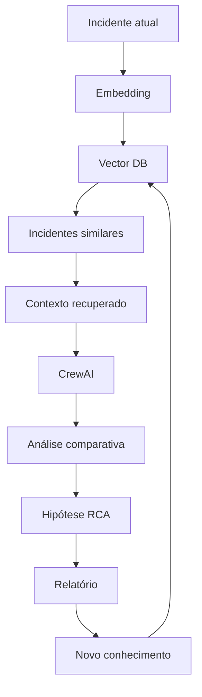

---

## 37. Matriz de maturidade do laboratório

| Nível | Capacidade | Situação |
|---|---|---|
| 1 | Crew executa com incidente fixo | Implementado |
| 2 | Relatório RCA gerado em Markdown | Recomendado |
| 3 | Múltiplos agentes especializados | Parcial |
| 4 | Entrada dinâmica de incidentes | Futuro |
| 5 | Consulta a tools externas | Futuro |
| 6 | RAG com histórico de incidentes | Futuro |
| 7 | Correlação com telemetria real | Futuro |
| 8 | BOT de war room | Futuro |

---

## 38. Proposta de pesquisa derivada

### Título sugerido

**Uso de agentes de IA para apoio à observabilidade e análise de causa raiz em ambientes distribuídos de missão crítica**

### Questão de pesquisa

Como arquiteturas baseadas em agentes de IA podem apoiar a inferência de causa raiz a partir de sinais externos de observabilidade?

### Variáveis de análise

| Variável | Descrição |
|---|---|
| Tempo de diagnóstico | Tempo entre incidente e hipótese inicial |
| Cobertura contextual | Quantidade de fontes analisadas |
| Qualidade da hipótese | Aderência à causa confirmada |
| Clareza documental | Qualidade do relatório RCA |
| Reuso | Capacidade de usar incidentes anteriores |
| Confiança | Grau de sustentação por evidências |

### Metodologia sugerida

1. construir protótipo;
2. simular incidentes;
3. comparar análise humana com análise assistida por agente;
4. medir tempo e qualidade da hipótese;
5. revisar resultados com especialistas;
6. refinar agentes e tasks;
7. documentar ganhos, limites e riscos.

---

## 39. Considerações éticas e operacionais

O uso de agentes de IA em incidentes deve respeitar limites claros:

1. o agente não deve executar ações corretivas sem validação;
2. hipóteses devem ser tratadas como sugestões;
3. dados sensíveis devem ser mascarados;
4. logs com dados pessoais devem seguir políticas internas;
5. o relatório deve indicar evidências ausentes;
6. decisões operacionais devem permanecer com responsáveis humanos.

---

## 40. Conclusão

O LAB01 demonstra que uma Crew simples já consegue estruturar uma análise inicial de incidente em formato útil para operação e engenharia. A contribuição principal do laboratório é conectar a visão acadêmica de observabilidade, baseada na inferência de estados internos por sinais externos, com uma implementação prática em agentes de IA.

O próximo avanço técnico é transformar o laboratório em um fluxo multiagente alimentado por dados reais de observabilidade, histórico de incidentes e base de conhecimento. Com essa evolução, o sistema pode se aproximar de um BOT de war room capaz de apoiar triagem, RCA, documentação e aprendizado contínuo.

---

## 41. Referências

DAHLEH, M.; DAHLEH, M. A.; VERGHESE, G. **6.241J Course Notes, Chapter 24: Observability**. Massachusetts Institute of Technology. Material de apoio sobre observabilidade em sistemas dinâmicos e teoria de controle.

FLANDERS, S. **What Is Observability?** Excerpt. Material sobre observabilidade moderna, monitoramento, sinais de telemetria, metadados, OpenTelemetry e sistemas distribuídos.

ELASTIC. **O Guia da Observabilidade Moderna: sua jornada de observabilidade começa aqui**. 2023. Material sobre maturidade de observabilidade, AIOps, OpenTelemetry, padrões abertos, processos, pessoas e tecnologia.

OPSRAMP. **The State of Observability 2024: Early promise but data and deployment challenges remain**. 2024. Relatório sobre adoção, desafios, custos e benefícios de observabilidade.

LOGICMONITOR. **The Ultimate Guide to Observability**. 2021. Guia sobre fundamentos de observabilidade, métricas, logs, traces, OpenTelemetry, topologia, IA e ML.

---

## 42. Apêndice: checklist rápido

```text
[ ] Projeto abre no VS Code
[ ] Ambiente virtual criado
[ ] crewai run executa
[ ] main.py contém topic, incidente e current_year
[ ] agents.yaml contém analista_incidente
[ ] agents.yaml contém redator_rca
[ ] tasks.yaml aponta para os agentes corretos
[ ] crew.py possui métodos @agent correspondentes
[ ] crew.py possui métodos @task correspondentes
[ ] saída aparece no terminal
[ ] relatório é salvo em relatorio_rca.md
```

---

## 43. Apêndice: visão geral em uma frase

O LAB01 é um protótipo de agentes de IA para transformar descrições de incidentes em análise técnica estruturada, conectando observabilidade, AIOps e RCA em um fluxo executável com CrewAI.
